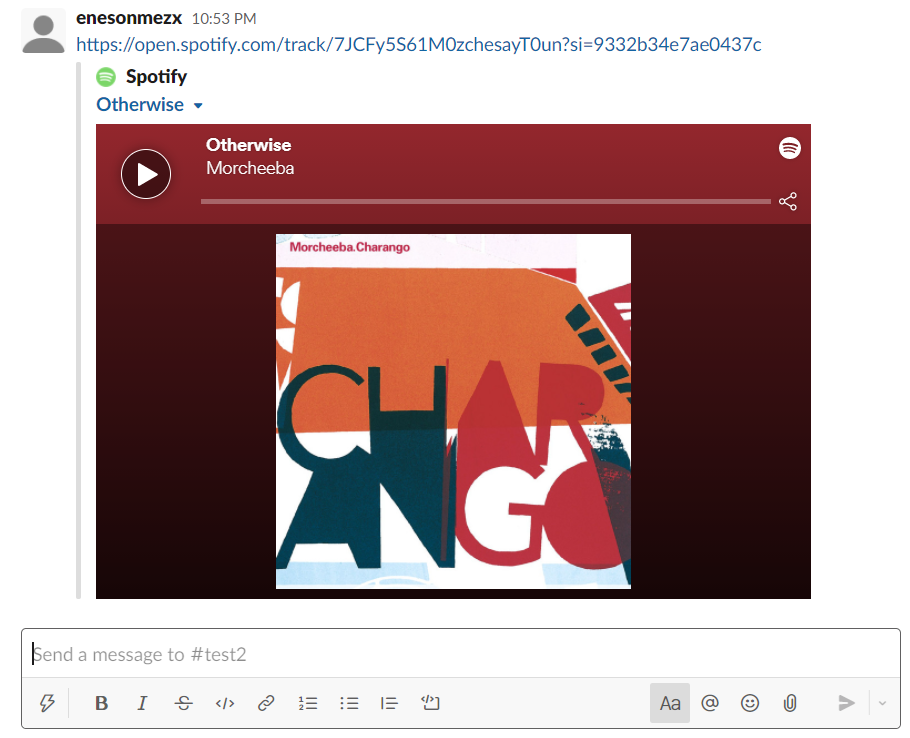

# Add Music to Playlist with Spotify - Slack Api

A module has been prepared that collects the spotify music urls sent to a channel you have determined in Slack and adds these songs to a playlist you want. Existing music in the playlist is not added again. Messages inside the channel in Slack receive messages sent during the current day. You can adapt this rule for yourself.  
(Slack'te belirlemiş olduğunuz bir kanala atılan spotify müzik url'lerini toplayarak
istediğiniz bir playlist'e bu şarkıları ekleyen bir modül hazırlanmıştır.
Playlist'te var olan bi müzik tekrardan eklenmez. Slack'teki kanalın içindeki
mesajlar, o gün içinde gönderilen mesajları alır. Bu kuralı 
kendinize göre uyarlayabilirsiniz.)

### Requirements (Gereklilikler)
Create a file named .env and define the following variables in it. 
(.env adında bir dosya oluşturun ve aşağıdaki değişkenleri içine tanımlayın.)
* SLACK_TOKEN = 'slack token'
* SPOTIFY_CLIENT_ID = 'client id' 
* SPOTIFY_CLIENT_SECRET = 'client secret'
* CHANNEL_ID = 'id of the channel to listen to on the slack'
* PLAYLIST_ID = 'the id of the playlist to which the music will be added on spotify'
* USER_NAME = 'spotify username'

