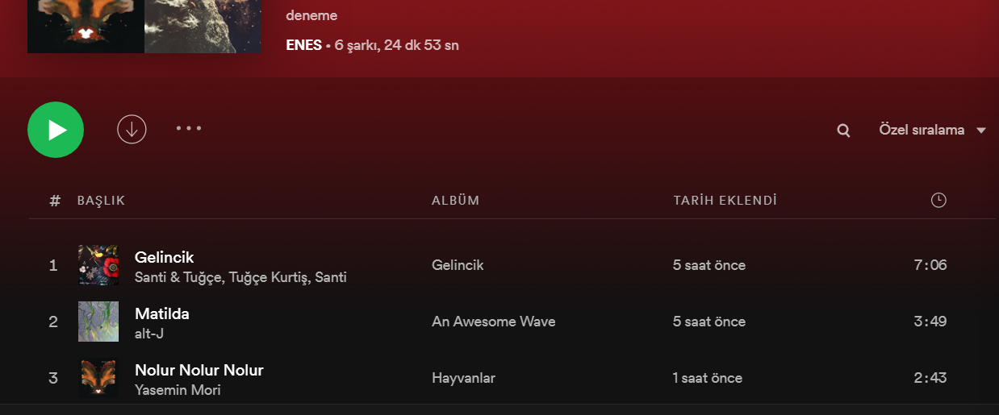

# About The Project (Add Music to Playlist with Spotify - Slack Api)
A module has been prepared for collecting spotify music urls sent to a channel you have determined in Slack and adding these songs to a playlist you want. 
Existing music in the playlist is not added again. 
Module only checks the slack messages sent yesterday for optimization. You can adapt this rule for yourself. <br>
(Slack'te belirlemiş olduğunuz bir kanala atılan spotify müzik url'lerini toplayarak istediğiniz bir playlist'e bu şarkıları ekleyen bir modül hazırlanmıştır.
Playlist'te var olan bi müzik tekrardan eklenmez. Slack'teki kanalın içindeki mesajlar, o gün içinde gönderilen mesajları alır. Bu kuralı kendinize göre uyarlayabilirsiniz.)




## Built With
You need to install the following python3 dependencies. If you do not want to install these dependencies, follow the installation step. (Aşağıdaki python bağımlılıklarını yüklemeniz gerekiyor. Eğer bağımlılıkları yüklemek istemiyorsanız, aşağıdaki kurulum adımlarını izleyin.)
* [spotipy](https://pypi.org/project/spotipy/)
* [dotenv ](https://pypi.org/project/python-dotenv/)
* [slackclient](https://pypi.org/project/python-dotenv/)

# Getting Started
## Prerequisites
* [python3](https://www.python.org/downloads/)

Create a file named .env and define the following variables in it.<br>
(.env adında bir dosya oluşturun ve aşağıdaki değişkenleri içine tanımlayın.)
```
SLACK_TOKEN = 'slack token'
SPOTIFY_CLIENT_ID = 'client id' 
SPOTIFY_CLIENT_SECRET = 'client secret'
CHANNEL_ID = 'id of the channel to listen to on the slack'
PLAYLIST_ID = 'the id of the playlist to which the music will be added on spotify'
USER_NAME = 'spotify username'
```

## Installation
1. **to Linux :** 
   - Go to the directory where you want to install the project and open the terminal.
   - sudo apt-get install python3-venv
   - python3 -m venv file-converter
   - cd file-converter
   - **git clone https://github.com/analyticahouse/add-music-playlist-with-spotify-slack-api**
   - source file-converter/bin/activate
   - pip3 install -r requirements.txt
   - python3 main.py
   - Write **deactivate** at terminal after the app is closed
2. **to Windows :**
   - Go to the directory where you want to install the project and open the terminal.
   - python get-pip.py
   - pip install virtualenv
   - **git clone https://github.com/analyticahouse/add-music-playlist-with-spotify-slack-api**
   - cd File-Converter
   - virtualenv -p python3 venv
   - venv\Scripts\activate
   - pip install -r requirements.txt
   - python main.py
   - Write **venv\Scripts\deactivate** at terminal after the app is closed

# License
Distributed under the MIT License. See LICENSE for more information.

# Contact
Enes SÖNMEZ - [@enesonmez](https://github.com/enesonmez) - enes@analyticahouse.com <br>

Project Link: https://github.com/analyticahouse/add-music-playlist-with-spotify-slack-api
